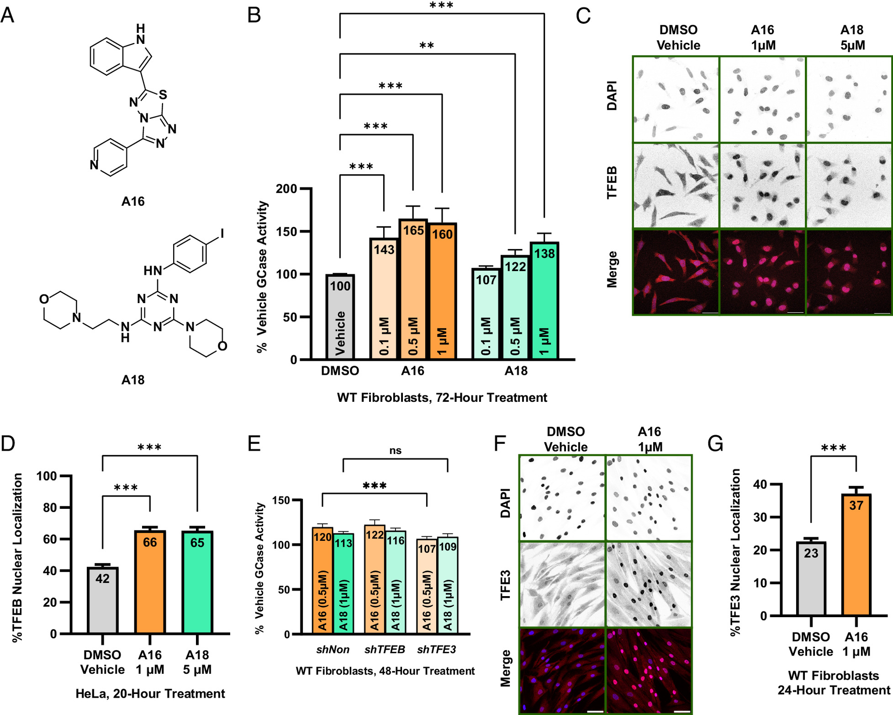
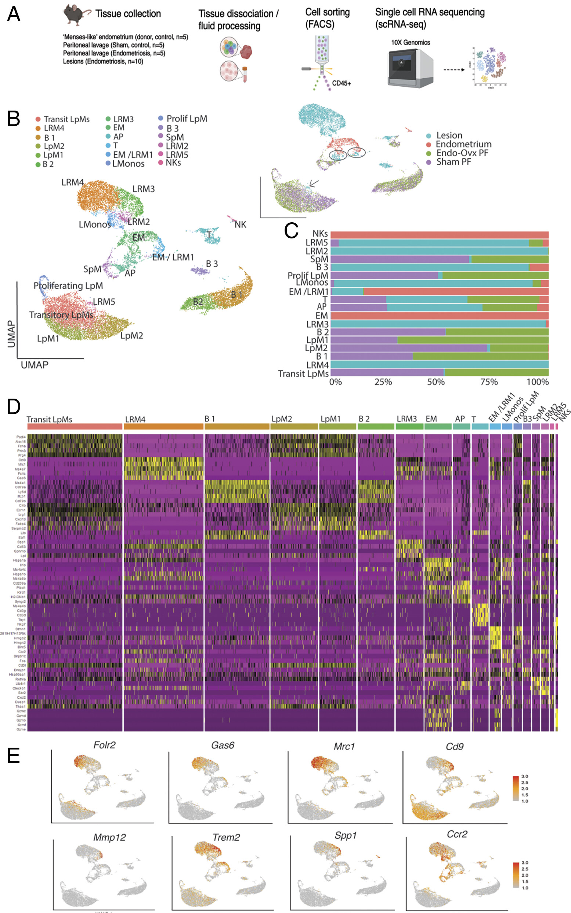
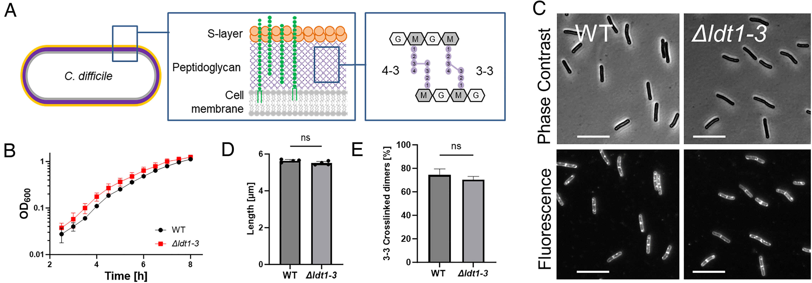
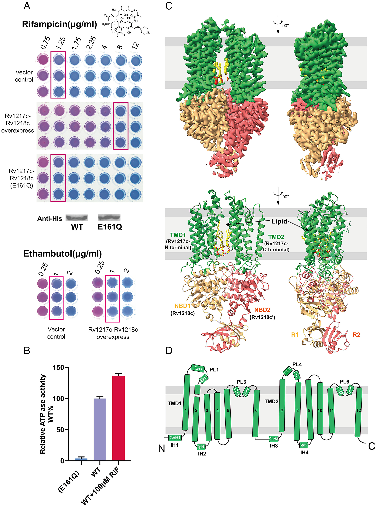
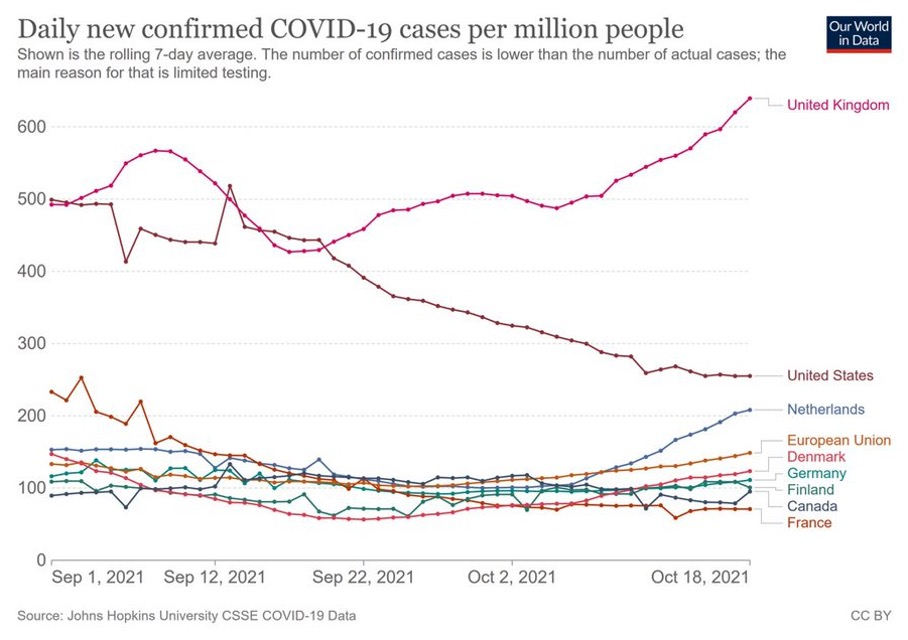
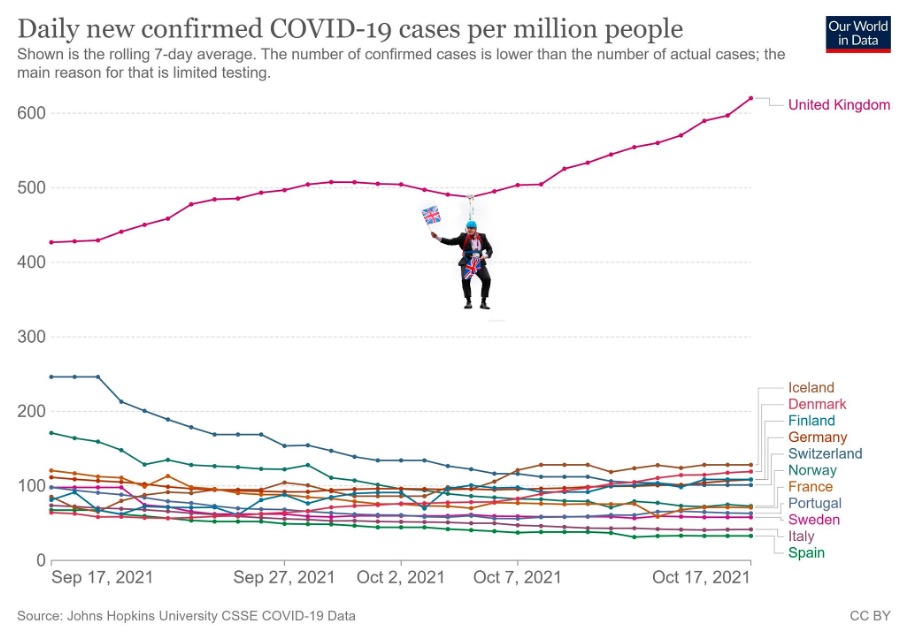

<style>
.forceBreak { -webkit-column-break-after: always; break-after: column; }
</style>

```{r setup, include=FALSE}
# Package imports
library(dplyr)
library(ggplot2)
library(ggthemes)
library(googlesheets4)
library(htmltools)
library(knitr)
library(stringr)
library(tidyr)
library(tm)
library(wordcloud)
library(wordcloud2)

# Authenticate with Google Forms
gs4_deauth()

# Grab data and clean it
dfm = read_sheet("https://docs.google.com/spreadsheets/d/1Qs3Hdeycu9Q8KBqpQ6qlv6NaUW62Al_PPWF96x1lACI/edit?resourcekey=&gid=1498908795#gid=1498908795")
colnames(dfm) = c("timestamp", "figure", "effectiveness", "understandable",
                  "appealing",
                  "bestpractice", "bestpractice_errors", "bestpractice_unsure",
                  "effectiveness_comment", "improvements",
                  "colours", "fonts", "labels", "statistics", "whitespace",
                  "data", "legend", "title", "reproduce_paper", "reproduce_raw",
                  "describe", "figure_comments", "time_taken", "numfigures",
                  "prereading", "other_comments")

# Ignore responses prior to 12/11/2024
dfm = dfm %>% filter(timestamp > "2024-10-12")

# Convert figure choice to integer
dfm = dfm %>% separate(figure, c("fignum"), remove=FALSE)

# Make columns the appropriate datatype
factor_headers = c("figure", "fignum", "bestpractice", "time_taken")
for (colname in factor_headers) {
  dfm[[colname]] = as.factor(dfm[[colname]])
}
dfm$fignum = factor(dfm$fignum, levels=c("1", "2", "3", "4"))
dfm$time_taken = factor(dfm$time_taken, levels=c("Less than 5 minutes","About 5 or 10 minutes","About 15 minutes","About 30 minutes","More than 30 minutes"))

# Function to generate Economist-style figures from categories
draw_economist_categories = function(dfm, categories, fig_num) {
  ratings = dfm %>%
    filter(fignum == fig_num) %>%
    pivot_longer(cols=all_of(categories),
                 names_to = "category",
                 values_to = "rating")
  ratings$rating = factor(ratings$rating, levels=c("1", "2", "3", "4", "5"))
  p = ggplot(ratings, aes(x=rating))
  p = p + geom_bar() +
    stat_count(geom="text", color="white", mapping=aes(label=..count..), vjust=2)
  p = p + facet_wrap(~category)
  p = p + theme_economist() + scale_x_discrete(drop=FALSE)
  p
}

# Function to generate Tufte-style figures from categories
draw_tufte_categories = function(dfm, categories, fig_num) {
  ratings = dfm %>%
    filter(fignum == fig_num) %>%
    pivot_longer(cols=all_of(categories),
                 names_to = "category",
                 values_to = "rating")
  p = ggplot(ratings, aes(x=category, y=rating))
  p = p + geom_violin(mapping=aes(fill=category), alpha=0.3, linewidth=0) 
  p = p + geom_point(position=position_jitter(height=0.1, width=0.1), alpha=0.4)
  # p = p + geom_violin(outlier.colour="red") + geom_point(position=position_jitter(height=0.1, width=0.1), alpha=0.35)
  p = p + theme_tufte() + ylim(1, 5) + coord_flip()
  p = p + scale_color_brewer(palette="Dark2")
  p = p + theme(legend.position = "none")
  p
}

# Function to generate hc-style figures from categories
draw_hc_categories = function(dfm, categories) {
  ratings = dfm %>%
    pivot_longer(cols=all_of(categories),
                 names_to = "category",
                 values_to = "rating")
  p = ggplot(ratings, aes(x=fignum, y=rating, color=fignum))
  p = p + geom_violin(mapping=aes(fill=fignum), alpha=0.15, linewidth=0) 
  p = p + geom_point(position=position_jitter(height=0.1, width=0.1), alpha=0.4)
  p = p + facet_wrap(~category, nrow=1)
  p = p + theme_hc() + scale_x_discrete(drop=FALSE) 
  p = p + theme(legend.position = "none")
  p = p + scale_color_brewer(palette="Dark2")
  p = p + scale_fill_brewer(palette="Dark2")
  p
}

# Process character column into a wordcloud
process_words = function(dfrm, column) {
  corpus = Corpus(VectorSource(dfrm[column]))
  comments = corpus %>%
    tm_map(removeNumbers) %>%
    tm_map(removePunctuation) %>%
    tm_map(stripWhitespace) %>%
    tm_map(content_transformer(tolower)) %>%
    tm_map(removeWords, stopwords("english")) %>%
    tm_map(removeWords, c("figure", "make", "figures", "graph", "graphs",
                          "perhaps", "including", "sure", "instead",
                          "first", "middle", "could", "couldve", "may",
                          "makes", "use", "also", "can", "much", "made",
                          "many", "shows", "mutant", "dont", "still", "isnt",
                          "whats", "via", "allow", "bit", "just", "drug",
                          "cell", "gcase", "try", "although", "cclear",
                          "slightly", "making", "around", "actually",
                          "way", "going", "like", "maybe", "etc", "dmso",
                          "doesnt", "might", "par", "should", "shouldve",
                          "didnt", "will", "data", "easy"))
  wordmat <- as.matrix(TermDocumentMatrix(comments))
  words <- sort(rowSums(wordmat), decreasing=TRUE)
  dfm_words <- data.frame(word = names(words), freq=words)
  dfm_words
}

# Globals

doi_fig1 = "10.1073/pnas.2320257121"
doi_fig2 = "10.1073/pnas.2405474121"
doi_fig3 = "10.1073/pnas.2408540121"
doi_fig4 = "10.1073/pnas.240342112"

# Code block options
knitr::opts_chunk$set(echo = FALSE, warning = FALSE)
```

# 1. Introduction

## Learning Objectives

- You should be able to critically analyse how data is visualised 
- You should be able to judge a figure's clarity and potential for misunderstanding
- You should be able to identify potential sources of bias resulting from the visualisation
- You should understand how to create effective figures for your own work

## Background Reading

- Introduction to Data Visualisation
  - [https://sipbs-compbiol.github.io/BM432/notebooks/04-data_presentation_workshop.html](https://sipbs-compbiol.github.io/BM432/notebooks/04-data_presentation_workshop.html)
  
- Interactive Data Visualisation examples
  - [https://sipbs-bm432.shinyapps.io/03-04a-barchart/](https://sipbs-bm432.shinyapps.io/03-04a-barchart/)
  
- Additional information:
  - ["Fundamentals of Data Visualisation" _by Claus O. Wilke_](https://clauswilke.com/dataviz/)
  - ["Data Visualisation: A Practical Introduction" _by Kieran Healy_](https://socviz.co/index.html#preface)
  - ["Points of View: graphic design for data visualisation"](git@github.com:sipbs-compbiol/bm432-datavis_workshop.git)
  
## Exercise: Four figures (assess all figures)

- **For each figure, consider the following:**
  - What type of data is being presented?
  - Are the data presented effectively? (why/why not?)
  - How can the data presentation be improved?
  - Use the DOI provided to find the paper the figure is from, if you need more information than is in the figure legend
- Fill in the _pro forma_ with your answers to the questions above (one sentence each)
  - [Google Form](https://forms.gle/cyJPnnuvVRazcTkk7)
  
# 2. Summary Results
  
## Responses by figure

- We received `r nrow(dfm)` ratings in total (at four figures per student, this is `r round(nrow(dfm)/4, 1)` students responding)

<center>
```{r overall_response}
figcounts = dfm %>% group_by(fignum) %>% summarize(count = n())
p = ggplot(figcounts, aes(y=fignum, x=count))
p + geom_point(size=8) + xlim(0, max(figcounts$count)) + theme_fivethirtyeight()
```
</center>

## Overall effectiveness

- How was effectiveness scored, distributed across all figures?

<center>
```{r overall_effectiveness}
p = ggplot(dfm, aes(x=effectiveness))
p = p + geom_histogram(binwidth=1) +
  stat_bin(binwidth=1, geom="text", color="white", mapping=aes(label=..count..), vjust=2, size=5)
p = p + theme(legend.position = "none")
p + theme_fivethirtyeight() + xlim(0.5, 5.5)
```
</center>

## Overall understandability

- How was understandability scored, distributed across all figures?

<center>
```{r overall_understanding}
p = ggplot(dfm, aes(x=understandable))
p = p + geom_histogram(binwidth=1) +
  stat_bin(binwidth=1, geom="text", color="white", mapping=aes(label=..count..), vjust=2, size=5)
p = p + theme(legend.position = "none")
p + theme_fivethirtyeight() + xlim(0.5, 5.5)
```
</center>

## Overall appeal

- How was appeal scored, distributed across all figures?

<center>
```{r overall_appeal}
p = ggplot(dfm, aes(x=appealing))
p = p + geom_histogram(binwidth=1) +
  stat_bin(binwidth=1, geom="text", color="white", mapping=aes(label=..count..), vjust=2, size=5)
p = p + theme(legend.position = "none")
p + theme_fivethirtyeight()  + xlim(0.5, 5.5)
```
</center>

## Time taken per figure

- How long did you take, per figure?

<center>
```{r overall_time_taken}
p = ggplot(dfm %>% drop_na(time_taken), aes(x=time_taken))
p = p + geom_bar() + stat_count(geom="text", aes(label=..count..), vjust=1.5, colour="white")
p + theme_fivethirtyeight() + theme(axis.text.x = element_text(angle = 90)) + scale_x_discrete(drop=FALSE)
```
</center>

# 3. Results By Figure

## Effectiveness/Understandability/Appeal

- How effective/understandable/appealing did you think each figure was?

<center>
```{r understandable_by_fig}
draw_hc_categories(dfm, c("effectiveness", "understandable", "appealing"))
```
</center>

## Colours/Fonts/Labels

- How well did each figure use colours, fonts, and labels?

<center>
```{r presentation_by_fig}
draw_hc_categories(dfm, c("colours", "fonts", "labels"))
```
</center>

## Statistics/Whitespace/Data

- How well did each figure use statistics, whitespace, and data?

<center>
```{r statistics_by_fig}
draw_hc_categories(dfm, c("statistics", "whitespace", "data"))
```
</center>

## Reproduction

- How well did you think you could reproduce each figure?

<center>
```{r reproduction_by_fig}
draw_hc_categories(dfm, c("describe", "reproduce_paper", "reproduce_raw"))
```
</center>

# 4. Individual Figures

## Figure 1 (doi:`r doi_fig1`)

<center>

</center>

## Figure 1 (doi:`r doi_fig1`) 

<center>
```{r fig1_main_summary}
draw_tufte_categories(dfm, c("effectiveness", "understandable", "appealing", "colours", "fonts", "labels", "statistics", "whitespace", "data", "legend", "title", "reproduce_paper", "reproduce_raw", "describe"), 1)
```
</center>

## Figure 1 (doi:`r doi_fig1`)  {.columns-2 .smaller}

<center>

</center>

<p class="forceBreak"></p>

- Suggested improvements (LP):
  - The lower extent of error bars is not visible in (B), (D), (G), or (E). Avoid "dynamite plots."
  - Bar charts should be avoided; 1D scatterplot for (D), (G), and (E) would be clearer. Line plot with concentration on $x$-axis would improve (B).
  - We can't see difference between effects of two concentrations of A16 in (D), or A16 vs A18 in (B); use a table of contrasts.
  - Place things to be compared by the reader next to each other where possible (E).

## Figure 1 (doi:`r doi_fig1`)  {.columns-2 .smaller}

<center>

</center>

<p class="forceBreak"></p>

- Suggested improvements (MF):
  - The scale on the micrographs (C) is too small to read easily.
  - In addition to showing DAPI and immunofluorescence images of the cells, we should really be seeing a bright-field micrograph of the cells (no fluorescence). 
  - The colour scheme is misleading (compare 1 $\mu$M A18 in B vs 5 $\mu$M in D)
  - Too many comparisons in B - chartjunk
  - y-axes scales should be the same to make intra-panel comparisons easier
  
## Figure 1 (doi:`r doi_fig1`)  {.smaller}

```{r fig1_improvements}
kable(dfm %>% filter(fignum==1) %>% select(improvements))
```


## Figure 2 (doi:`r doi_fig2`)

<center>

</center>


## Figure 2 (doi:`r doi_fig2`) 

<center>
```{r fig2_main_summary}
draw_tufte_categories(dfm, c("effectiveness", "understandable", "appealing", "colours", "fonts", "labels", "statistics", "whitespace", "data", "legend", "title", "reproduce_paper", "reproduce_raw", "describe"), 2)
```
</center>


## Figure 2 (doi:`r doi_fig2`)  {.columns-2 .smaller}

<center>

</center>

<p class="forceBreak"></p>

- Suggested improvements (LP):
  - UMAP plots (B, E) are highly manipulable and clustering/placement does not necessarily reflect objective measures.
  - Unpleasant colour choices in (C); there is room for aesthetic improvement.
  - The proportion plot in (C) does not give information on absolute number, only proportion; a proportional areas plot spanning all clusters would more honestly represent the data.
  - Heatmap text is too small to read comfortably; is there too much data here?

## Figure 2 (doi:`r doi_fig2`)  {.columns-2 .smaller}

<center>

</center>

<p class="forceBreak"></p>

- Suggested improvements (MF):
  - The flow diagram (A) could make better use of arrows to illustrate order of steps
  - Text overall is too hard to read comfortably
  - Heatmap in (D) is missing a scale (is purple high and yellow low, or vice versa?)
  - Consider what is needed to convey the figure's intended message: if it's just that these macrophages exhibit transcriptional heterogeneity, then D is probably sufficient for that purpose - the other panels don't add much for me
  - Whitespace usage could be improved - cramming (C) under the inset from (B) makes the figure feel very crowded

## Figure 2 (doi:`r doi_fig2`)  {.smaller}

```{r fig2_improvements}
kable(dfm %>% filter(fignum==2) %>% select(improvements))
```


## Figure 3 (doi:`r doi_fig3`)

<center>

</center>

## Figure 3 (doi:`r doi_fig3`) 

<center>
```{r fig3_main_summary}
draw_tufte_categories(dfm, c("effectiveness", "understandable", "appealing", "colours", "fonts", "labels", "statistics", "whitespace", "data", "legend", "title", "reproduce_paper", "reproduce_raw", "describe"), 3)
```
</center>

## Figure 3 (doi:`r doi_fig3`)  {.columns-2 .smaller}

<center>

</center>

<p class="forceBreak"></p>

- Suggested improvements (LP):
  - The lower extent of error bars is not visible in (D) or (E). These are "dynamite plots," which should be avoided.
  - Bar charts should be avoided in general; a 1D scatterplot of each dataset in (D) and (E) would be clearer.


## Figure 3 (doi:`r doi_fig3`)  {.columns-2 .smaller}

<center>

</center>

<p class="forceBreak"></p>

- Suggested improvements (MF):
  - Failure to complement the triple mutant strain???
  - Fluorescence wavelength not specified (C)
  - Colour scheme in (A) is inconsistent
  - Axis label in (B) could be improved
  - Figure legend for (A) could be more succinct/some of this info should be in the paper text instead


## Figure 3 (doi:`r doi_fig3`)  {.smaller}

```{r fig3_improvements}
kable(dfm %>% filter(fignum==3) %>% select(improvements))
```


## Figure 4 (doi:`r doi_fig4`)

<center>

</center>

## Figure 4 (doi:`r doi_fig4`) 

<center>
```{r fig4_main_summary}
draw_tufte_categories(dfm, c("effectiveness", "understandable", "appealing", "colours", "fonts", "labels", "statistics", "whitespace", "data", "legend", "title", "reproduce_paper", "reproduce_raw", "describe"), 4)
```
</center>

## Figure 4 (doi:`r doi_fig4`)  {.columns-2 .smaller}

<center>

</center>

<p class="forceBreak"></p>

- Suggested improvements (LP):
  - The rifampicin structure is purely decorative and could be removed.
  - The lower extent of error bars is not visible in (B). This is a "dynamite plot," which should be avoided.
  - Bar charts should be avoided in general; a 1D scatterplot of each dataset in (B) would be clearer.
  - The implied membrane in (C) and (D) could be stated as such in the figure.

## Figure 4 (doi:`r doi_fig4`)  {.columns-2 .smaller}

<center>

</center>

<p class="forceBreak"></p>

- Suggested improvements (MF):
  - Colours in (A) difficult to distinguish, especially with the red boxes which seem to skew blue closer to purple
  - The Western blot in (A) showing 2 cut-out bands is absolutely not an appropriate way to present this type of data - show the whole thing
  - Colour scheme in (B) doesn't seem purposeful and doesn't add anything to the figure
  - Text in (D) is too small to read easily
  - By convention in microbiology, would assume that the periplasm/extracellular space is "up" and the cytoplasm is "down" in (C) and (D) - but this should really be labelled to avoid any potential confusion
  
  
## Figure 4 (doi:`r doi_fig4`)  {.smaller}

```{r fig4_improvements}
kable(dfm %>% filter(fignum==4) %>% select(improvements))
```

# 5. Summing Up

## General Comments

- Colour choices
- Larger figures/graphs, more space between figures/graphs
- Too much data per figure
- Split into multiple figures
- Remove unnecessary data (how do we define this?)
- “The data is presented in a manner that would likely be inaccessible for people without prior experience. A move toward a more palatable/digestible format will facilitate better science communication in the future.”

## Visualising Data About Data Visualisation

- What did you say about figure effectiveness?

<center>
```{r eff_wordcloud}
effwords = process_words(dfm, "effectiveness_comment")
wordcloud2(data=effwords, size=1.6, color='random-dark')
```
</center>

## Visualising Data About Data Visualisation

- What words did you use to describe potential figure improvements?

<center>
```{r imp_wordcloud}
impwords = process_words(dfm, "improvements")
wordcloud(words = impwords$word, freq = impwords$freq, min.freq = 1, max.words=200, random.order=FALSE, rot.per=0.35,            colors=brewer.pal(8, "Dark2"))
```
</center>

## Data Visualisation is Not Neutral  {.columns-2}

<center>

</center>

<center>

</center>


